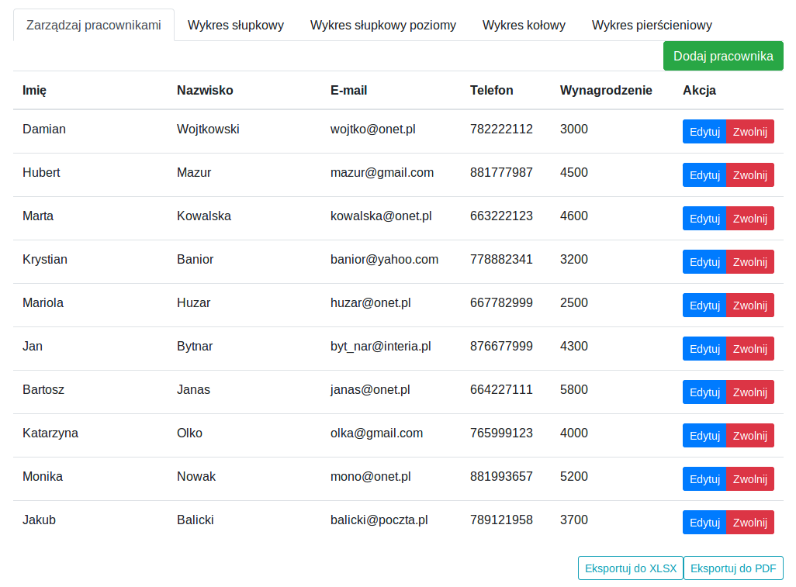
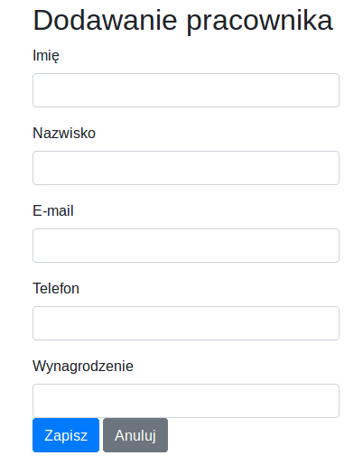
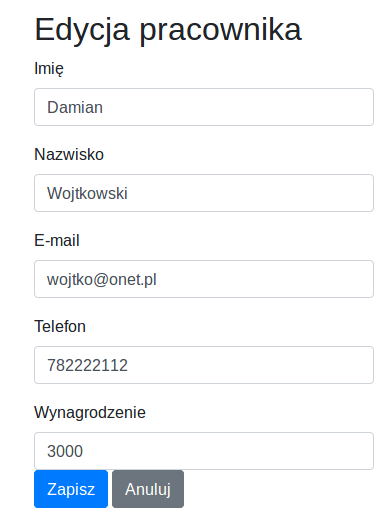
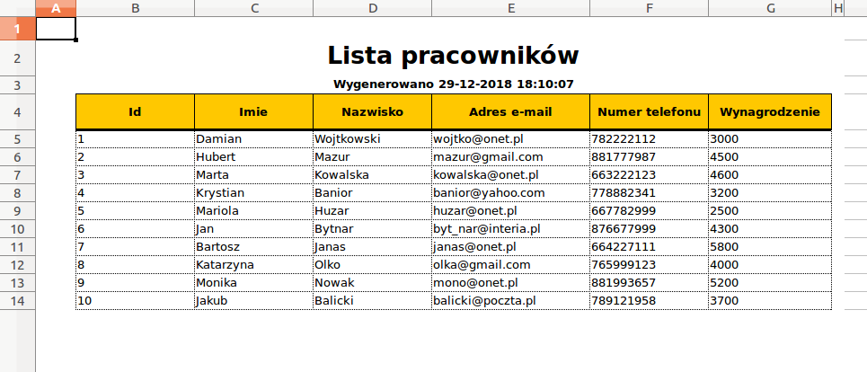
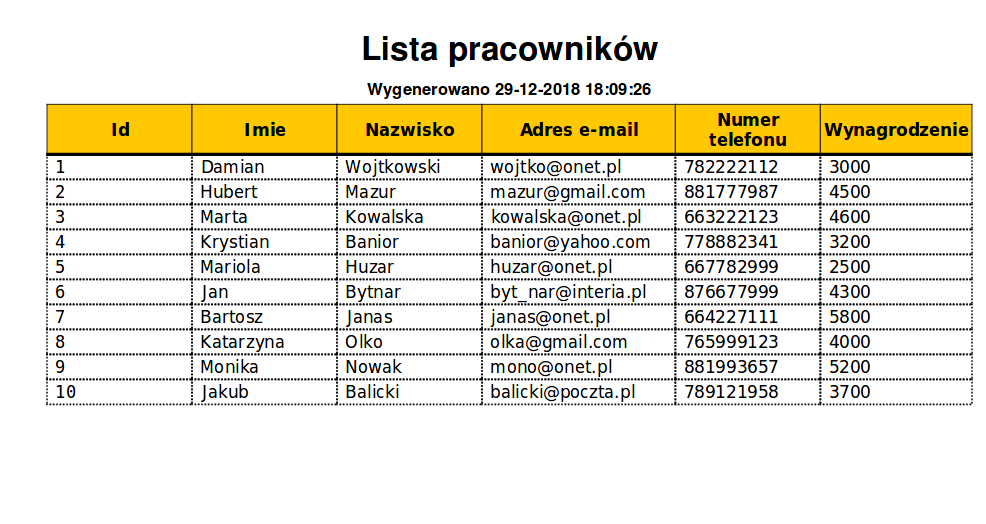
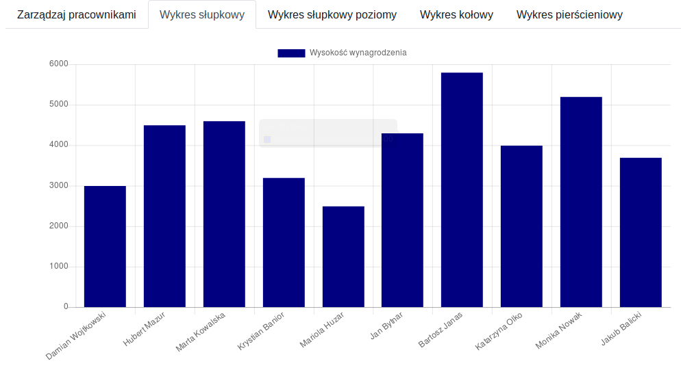
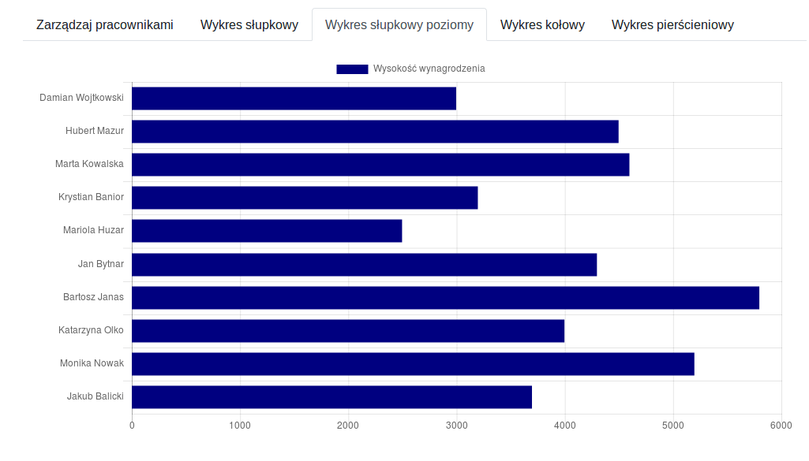
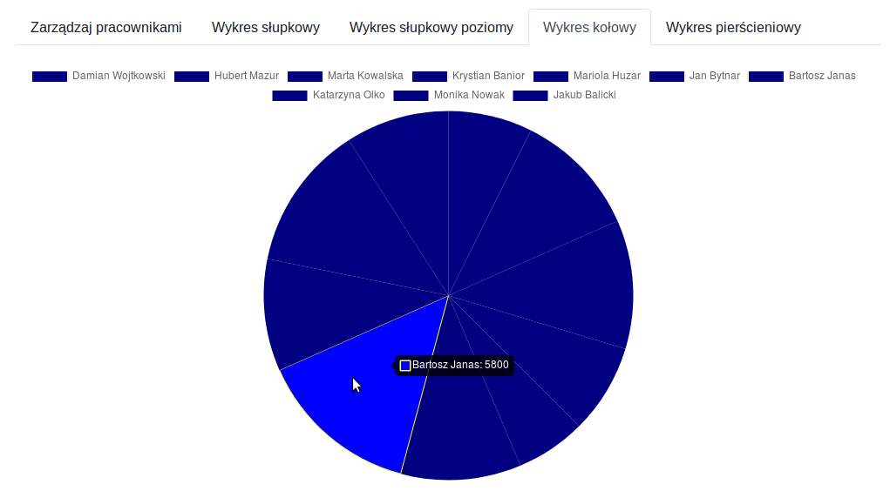
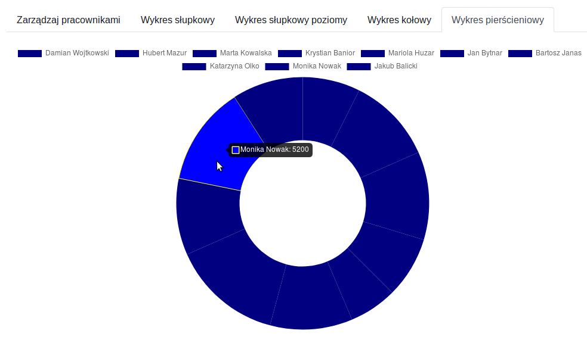

# Dokumentacja projektowa

### Aplikacja webowa do zarządzania i generowania (w postaci graficznej i tekstowej) raportów biznesowych.

#### Analiza wymagań funkcjonalnych:

- Użytkownik może wyświetlić listę pracowników.

- Użytkownik może dodawać pracowników.

- Użytkownik może edytować pracowników.

- Użytkownik może usuwać pracowników.

- Użytkownik może generować raport w  formacie PDF i XLSX.

- Użytkownik może wyświetlać wykresy oparte na pracownikach i ich wynagrodzeniach.

## Technologie
**Backend:**

Transfer pomiędzy serwerem a bazą danych przebiega przez repozytoria JPA. 
W pakiecie „Model” zaimplementowano model pracownika, który przy wykorzystaniu mapowania obiektowo – relacyjnego reprezentuję encję pracownika w kodzie aplikacji. 
Klasa kontrolera odpowiada za mapowanie adresów URL na metody wykonywane w programie. W przypadku naszej aplikacji klasa kontrolera odpowiada za zwracanie 
plików do interfejsu użytkownika. Całość logiki CRUD dla encji pracownika wykonywana jest bezpośrednio przez repozytoria z pominięciem kontrolera, dzięki Spring Data REST.  

- Wykorzystana technologia: **Spring Boot, Spring Data REST**
- Wykorzystane narzędzia: **Maven**
- Format wymiany danych: **JSON**

Zewnętrzne biblioteki:

- **Flyway** – mechanizm migracji,
- **Lombok** – generowanie getterów/setterów i konstruktorów,
- **DynamicJasper / JasperReports** – generowanie raportów biznesowych,

**Frontend:**

Głównym elementem interfejsu użytkownika jest kontener zawierający kilka kart, 
między którymi można się poruszać przy wykorzystaniu nawigatora 
znajdującego się w górnej części kontenera: 
- lista użytkowników z przyciskami realizującymi zapytania do naszego API i generującymi raporty,
- wykres słupkowy, 
- wykres słupkowy poziomy, 
- wykres kołowy
- wykres pierścieniowy. 

Wykorzystana technologia: **React.JS**

Zewnętrzne biblioteki:
- **axios** - zapytania do API przy wykorzystaniu funckji protokołu HTTP,
- **reactstrap** - (React.js + Bootstrap) - komponenty Bootstrapa w kodzie React.js,
- **react-router** - mapowanie adresów URL na komponenty,
- **react-chartjs-2** - generowanie wykresów

## Podręcznik użytkownika
####  Po uruchomieniu aplikacji użytkownik zostaje przeniesiony do widoku listy pracowników.  
  

#### Po kliknięciu przycisku "Dodaj pracownika" w prawym górnym rogu, użytkownik zostaje przeniesiony do formularza dodawania.  
  

#### Po kliknięciu "Edytuj" w wierszu tabeli należącym do jednego z pracowników, użytkownik zostaje przeniesiony do formularza edycji.  
  

#### Po kliknięciu "Zwolnij" pracownik jest usuwany z bazy danych, a widok listy pracowników odświeża się.  

#### Po kliknięciu przycisku "Eksportuj do XLSX" użytkownik może otworzyć lub pobrać plik raportu w formacie arkusza kalkulacyjnego.  
  

#### Po kliknięciu przycisku "Eksportuj do PDF" użytkownik może otworzyć lub pobrać plik raportu w formacie dokumentu PDF.  
  
#### Po przejściu do zakładki "Wykres słupkowy" w górnym panelu nawigacyjnym, zostaje wyświetlony wykres słupkowy stworzony na podstawie wynagrodzeń pracowników.  
  

#### Po przejściu do zakładki "Wykres słupkowy poziomy" w górnym panelu nawigacyjnym, zostaje wyświetlony poziomy wykres słupkowy.  
  
#### Po przejściu do zakładki "Wykres kołowy", zostaje wyświetlony wykres kołowy.  
  
#### Po przejściu do zakładki "Wykres pierścieniowy", zostaje wyświetlony wykres pierścieniowy.  
  

##### Wykonali:
- Dariusz Niemczycki
- Damian Samek
Informatyka III, AI L1
